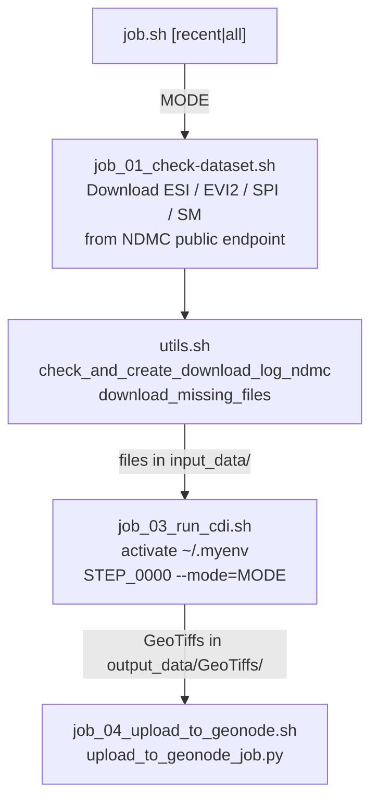
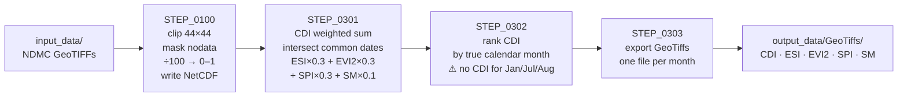
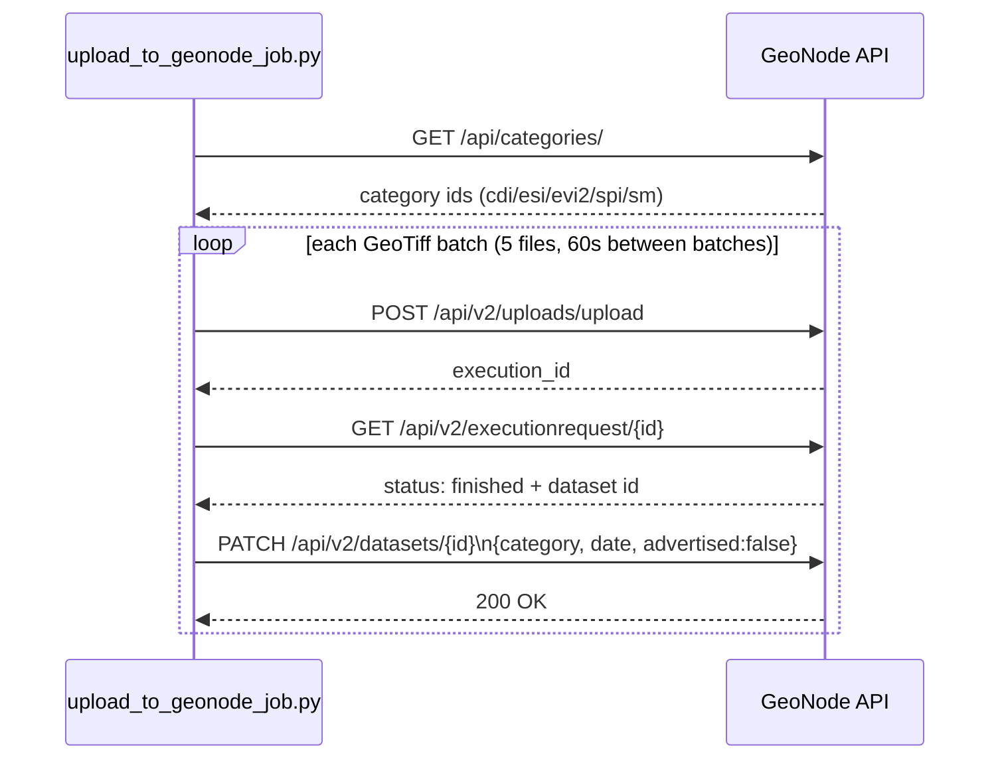

# CLAUDE.md

This file provides guidance to Claude Code (claude.ai/code) when working with code in this repository.

## What This Project Does

Monthly automation pipeline that downloads satellite/climate datasets, runs the NDMC Combined Drought Indicator (CDI) algorithm over Eswatini, and uploads the resulting GeoTiff rasters to a GeoNode instance. Designed to run via cron on a Linux server.

## Commands

### Run the full pipeline
```bash
./src/background-job/job.sh recent   # last 2 years (default; for validation)
./src/background-job/job.sh all       # full history (SPI from 2023); for VM/production
```

### Run with upload limit (useful for testing)
```bash
UPLOAD_RECENT_LIMIT=5 ./src/background-job/job.sh recent
```

### Run CDI processing only (requires Python venv `~/.myenv`)
```bash
source ~/.myenv/bin/activate
python -u src/data-processing/cdi-scripts/STEP_0000_execute_all_steps.py --mode=all
# or --mode=recent to process only the last 24 months
```

### Run GeoNode upload only
```bash
cd src/background-job
source ~/.myenv/bin/activate
python -u upload_to_geonode/upload_to_geonode_job.py
```

### Run tests
```bash
cd src/background-job
source ~/.myenv/bin/activate
pytest upload_to_geonode/__tests__/
# Run a single test
pytest upload_to_geonode/__tests__/test_upload_geonode.py::test_upload_to_geonode
```

## Setup

```bash
cp env.example .env
# Edit .env with credentials (see env.example for all required variables)
```

Required system tools: `wget`, `pup`, `curl`.
Required Python venv at `~/.myenv` with packages from `src/data-processing/cdi-scripts/requirements.txt`.

## Architecture

All four input datasets come from the public NDMC Regional Percentiles endpoint
(`https://droughtcenter.unl.edu/Outgoing/Regional_Percentiles/Southern_Africa/`) as
pre-ranked GeoTIFFs. **No authentication** is required. The data is already
percentile-ranked (0–100), so the pipeline only clips, scales, and ranks-by-month.

### Pipeline Flow



`MODE`: `recent` (last 2 years, default) or `all` (full history; SPI starts 2023).

### Input Datasets (NDMC subdirectories)

| CDI key | NDMC dir | Replaces | History |
|---------|----------|----------|---------|
| ESI  | `era5_esi_1mn`   | MODIS LST  | 2012–present, full |
| EVI2 | `evi2_1mn`       | MODIS NDVI | 2012–present, **missing Jan/Jul/Aug** |
| SPI  | `chirps_spi_3mn` | computed SPI | **2023**–present, full |
| SM   | `noah_soilm_1mn` | FLDAS SM   | 2012–present, full |

### CDI Processing Steps (`src/data-processing/cdi-scripts/`)

Executed by `STEP_0000_execute_all_steps.py`:



Configuration is driven by three JSON conf files (relative to `cdi-scripts/`):
- `cdi_project_settings.conf` — region bounds, CDI weights (`esi:0.3, evi2:0.3, spi:0.3, sm:0.1`), SPI periods. **Weights must sum to 1.0** (checked with a 1e-6 tolerance).
- `cdi_directory_settings.conf` — paths for input/output data (`raw_data_dirs`: `esi_tif`, `evi2_tif`, `spi_tif`, `sm_tif`)
- `cdi_pattern_settings.conf` — `ndmc_tif_regex` matching `{dataset}_YYYY-MM-01.tif`

**Weight-based conditional downloads**: `job.sh` reads `cdi_project_settings.conf` to skip downloading datasets with weight `0`.

### GeoNode Upload (`src/background-job/upload_to_geonode/`)

Two upload scripts:
- `upload_to_geonode_job.py` — uploads all GeoTiff categories (CDI, SPI, ESI, EVI2, SM) in batches of 5 with 60s inter-batch delay; respects `UPLOAD_RECENT_LIMIT` env var. Categories: `cdi/spi/esi/evi2/sm-raster-map`.
- `upload_cdi_to_geonode_job.py` — CDI-only upload with optional date-range filtering

Upload flow:



GeoTiff filename convention: `<name>_YYYYMM.tif`. Upload scripts parse the date from this suffix.

### Data Directories

```
input_data/{ESI,EVI2,SPI,SM}/                 — raw downloaded NDMC GeoTIFFs
output_data/STEP_0100_*_pct_rank_*.nc          — ranked NetCDF intermediates
output_data/GeoTiffs/{CDI,SPI,ESI,EVI2,SM}/   — processed GeoTiff outputs
logs/                                          — URL download logs (all-{NAME}_URLS.log)
```

`cleanup_output_data()` in `utils.sh` deletes all intermediate `.nc` and output `.tif` files before each CDI run.

## Key Conventions

- All shell scripts source `.env` from repo root via `export $(grep -v '^#' "$root_path/.env" | xargs)`.
- Python scripts run inside `~/.myenv`; activated/deactivated by the calling shell scripts.
- Download logs track which remote files exist; comparison against the local directory determines what needs downloading.
- Batch downloads of missing files run 10 concurrent `wget` subshells with a 30s pause between batches.
- `VERIFY = True` in Python upload scripts — SSL verification must remain enabled.

---

<!-- code-review-graph MCP tools -->
## MCP Tools: code-review-graph

**IMPORTANT: This project has a knowledge graph. ALWAYS use the
code-review-graph MCP tools BEFORE using Grep/Glob/Read to explore
the codebase.** The graph is faster, cheaper (fewer tokens), and gives
you structural context (callers, dependents, test coverage) that file
scanning cannot.

### When to use graph tools FIRST

- **Exploring code**: `semantic_search_nodes` or `query_graph` instead of Grep
- **Understanding impact**: `get_impact_radius` instead of manually tracing imports
- **Code review**: `detect_changes` + `get_review_context` instead of reading entire files
- **Finding relationships**: `query_graph` with callers_of/callees_of/imports_of/tests_for
- **Architecture questions**: `get_architecture_overview` + `list_communities`

Fall back to Grep/Glob/Read **only** when the graph doesn't cover what you need.

### Key Tools

| Tool | Use when |
|------|----------|
| `detect_changes` | Reviewing code changes — gives risk-scored analysis |
| `get_review_context` | Need source snippets for review — token-efficient |
| `get_impact_radius` | Understanding blast radius of a change |
| `get_affected_flows` | Finding which execution paths are impacted |
| `query_graph` | Tracing callers, callees, imports, tests, dependencies |
| `semantic_search_nodes` | Finding functions/classes by name or keyword |
| `get_architecture_overview` | Understanding high-level codebase structure |
| `refactor_tool` | Planning renames, finding dead code |

### Workflow

1. The graph auto-updates on file changes (via hooks).
2. Use `detect_changes` for code review.
3. Use `get_affected_flows` to understand impact.
4. Use `query_graph` pattern="tests_for" to check coverage.
