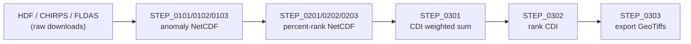
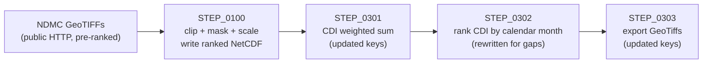

# NDMC Regional Percentiles Migration

## Context

The MODIS LST and NDVI feeds that the Eswatini CDI pipeline relied on have been retired (see [lst-ndvi-retirement-mail.md](lst-ndvi-retirement-mail.md)). NDMC team confirmed:

- **LST directory is empty** — MODIS products reached end-of-life; VIIRS does not include LST
- **NDVI format changed** from HDF to GeoTIFF, but NDMC has replaced both with superior indices
- **New data source**: pre-processed, percentile-ranked regional GeoTIFFs at `https://droughtcenter.unl.edu/Outgoing/Regional_Percentiles/Southern_Africa/`

NDMC team recommended **Option 1** (pre-processed percentile-ranked GeoTIFFs), which the project team / national authority accepted on 30 April 2026. Data became available 3 June 2026.

## What Changes

| Old | New |
|-----|-----|
| MODIS LST (HDF, NASA Earthdata auth) | ESI — Evaporative Stress Index (`era5_esi_1mn`) |
| MODIS NDVI (HDF, NASA Earthdata auth) | EVI2 — 2-Band Enhanced Vegetation Index (`evi2_1mn`) |
| CHIRPS raw download + SPI computation | Pre-ranked SPI from NDMC (`chirps_spi_3mn`) |
| FLDAS soil moisture (NASA Earthdata auth) | NOAH soil moisture (`noah_soilm_1mn`) |
| Complex HDF→NetCDF→anomaly→percent-rank pipeline | Single ingest step (data is already percent-ranked) |

## New Data Source

```
https://droughtcenter.unl.edu/Outgoing/Regional_Percentiles/Southern_Africa/
├── era5_esi_1mn/{YYYY}/era5_esi_1mn_{YYYY}-{MM}-01.tif
├── evi2_1mn/{YYYY}/evi2_1mn_{YYYY}-{MM}-01.tif
├── chirps_spi_3mn/{YYYY}/chirps_spi_3mn_{YYYY}-{MM}-01.tif
└── noah_soilm_1mn/{YYYY}/noah_soilm_1mn_{YYYY}-{MM}-01.tif
```

- **No authentication required** — public HTTP
- **Format**: compressed GeoTIFF (ZSTD), Float32, ~330–380 KB/file
- **NoData value**: `-1`
- **Value range**: `0–100` (percentile-ranked, confirmed via gdalinfo)
- **CRS**: EPSG:4326, 0.05° pixel, extent 12–43°E / 18–36°S (Southern Africa)
- **History**: 2012–2026 (all datasets)

## Pipeline Before vs After

**Before** (6 steps → NetCDF intermediates → GeoTiff):



**After** (1 ingest step → same downstream):



## Scope

- **Bash jobs**: refactor `job_01`, delete `job_00` and `job_02`, add `--mode` flag to `job.sh`
- **Python CDI**: new `STEP_0100`, delete STEP_0101–0103 + STEP_0201–0203, update STEP_0000/0301/0303
- **Config**: rename `lst`/`ndvi` keys to `esi`/`evi2` throughout conf files
- **GeoNode upload**: update category identifiers from `lst-raster-map`/`ndvi-raster-map` to `esi-raster-map`/`evi2-raster-map`

## Related Documents

- [requirements.md](requirements.md) — full functional and non-functional requirements
- [design.md](design.md) — architecture decisions and technical findings
- [implementation-plan.md](implementation-plan.md) — ordered task list for implementation
- [lst-ndvi-retirement-mail.md](lst-ndvi-retirement-mail.md) — original email thread from NDMC
