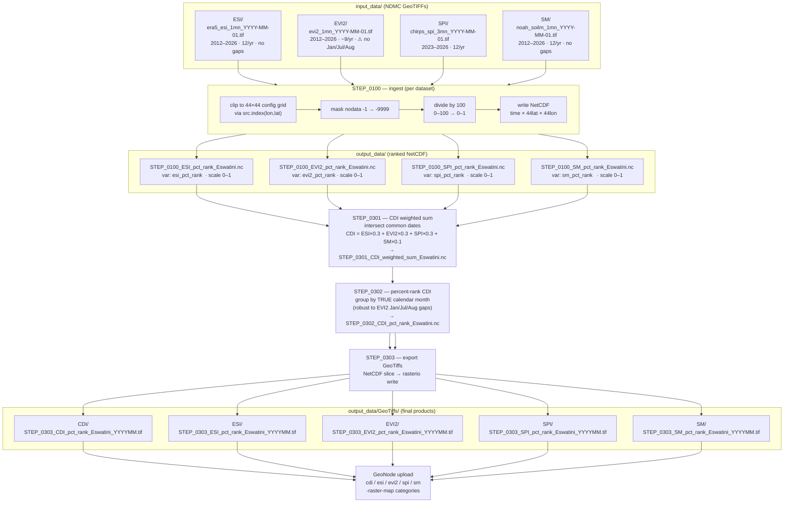
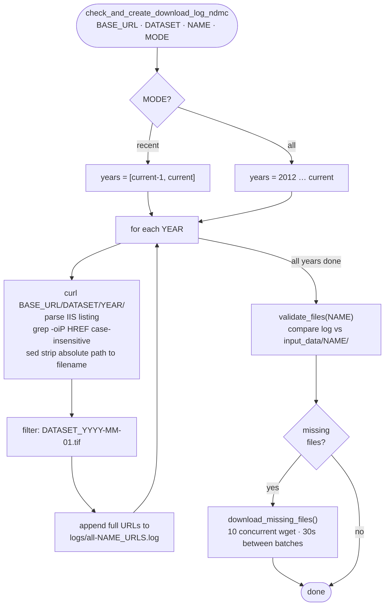

# Design: NDMC Regional Percentiles Migration

## Architecture Decision: NetCDF intermediates are kept

**Decision**: STEP_0100 writes NetCDF files as output, not GeoTIFFs.

**Reason**: STEP_0301 (`CDI_weighted_sum.py`) reads time-series NetCDF using the `netCDF4` library and aligns time dimensions across all inputs to find common dates. This multi-year time-series alignment is the core of the CDI computation and cannot be done with individual GeoTIFF files without a full rewrite of STEP_0301/0302/0303.

**Trade-off**: Slightly more complexity in STEP_0100 (must write NetCDF), but STEP_0301, STEP_0302, and STEP_0303 require zero logic changes beyond variable name/filename updates.

---

## NDMC Data — Confirmed Properties (from gdalinfo on live sample)

Sample file: `era5_esi_1mn/2026/era5_esi_1mn_2026-04-01.tif`

| Property | Value |
|----------|-------|
| Value range | 0.135 – 99.865 (**0–100 scale**) |
| NoData value | **-1** |
| CRS | EPSG:4326 (WGS84) |
| Pixel size | 0.05° (same as Eswatini pipeline) |
| Data type | Float32 |
| Extent | 12–43°E, 18–36°S (Southern Africa region) |
| Grid size | 620 cols × 360 rows |
| Compression | ZSTD |
| Valid pixels | ~52.7% (ocean/outside-region = nodata) |

**Eswatini bounds** (from `cdi_project_settings.conf`): 30.675–32.825°E, -27.825– -25.675°N — fully inside the NDMC extent.

---

## Architecture Decision: Output grid is the config-generated 44×44 grid (not the notebook's 43×43 clip)

**Decision**: STEP_0100 must write data on the exact latitude/longitude grid produced by `config_reader.get('latitudes')` / `get('longitudes')`, **not** a naïve `rasterio.from_bounds` window.

**Why this matters**: `config_reader` *generates* the grid from `bounds` at 0.05° resolution, inclusive of both endpoints:
- latitudes: -25.675 → -27.825 step -0.05 ⇒ **44 points**
- longitudes: 30.675 → 32.825 step 0.05 ⇒ **44 points**

So the pipeline grid is **44 rows × 44 cols**. `STEP_0301` allocates `np.full((len(latitudes), len(longitudes)), missing)` and `STEP_0303` writes GeoTiffs at `len(longitudes) × len(latitudes)` — both assume 44×44. If STEP_0100 writes a different shape, STEP_0301 raises a broadcast/shape error.

**Pixel alignment**: The config cell centres (30.675, 30.725, … 32.825 and -25.675, … -27.825) fall **exactly on NDMC pixel centres** (NDMC grid: 0.05° pixels, centres at 12.025 + k·0.05). Therefore STEP_0100 can index NDMC pixels directly by coordinate (`src.index(lon, lat)`) and read a 44×44 block with no resampling.

**Note on the validation notebook**: `eswatini_cdi_ndmc_validation.ipynb` uses `rasterio.windows.from_bounds(...)`, which treats the bounds as window *edges* and rounds to **43×43**. That is acceptable for NDMC's visual validation (the maps look identical), but the **production STEP_0100 must use the 44×44 config grid**. Do not copy the notebook's clip shape into production.

---

## Scientific Finding: Drought polarity of ESI vs the retired LST term

**Old LST term**: `STEP_0101` computes the anomaly of the **LST day–night delta** (`LST_Day - LST_Night`). A *large* delta indicates dry conditions (bare/dry surfaces swing more between day and night). `STEP_0201` ranks this directly, so **high `lst_anom_pct_rank` = drier**.

**All NDMC percentiles** (ESI, EVI2, SPI, SM): **high percentile = wetter / less drought**. ESI in particular: low ESI = high evaporative stress = drought, so high ESI percentile = wet.

**Implication**: In the *old* CDI weighted sum, the LST term pulled in the **opposite** direction to NDVI/SPI/SM (which are all "high = wet"). Replacing LST with ESI makes all four inputs share the same "high = wet" polarity, so the **new CDI is more internally consistent** than the old one.

**Action**:
- Do **not** invert ESI to reproduce the old LST behaviour — that would re-introduce the polarity inconsistency.
- Confirm with NDMC that ESI percentile orientation is "high = low stress = wet" (added as a validation question in the notebook).

---

## Architecture Decision: STEP_0302 ranks by TRUE calendar month (was positional)

**Decision**: STEP_0302 now groups CDI slices by the actual calendar month derived from each slice's `time` value, then percent-ranks within each group. This replaces the original `for index in range(0, 12)` + `index + 12` positional arithmetic.

**Why the change was required**: The original logic assumed a **gap-free** monthly series — that time index `i` and `i + 12` are always the same calendar month. That held for the old MODIS/CHIRPS feeds. The NDMC vegetation inputs are permanently missing Jul/Aug (and Jan for EVI2), so after STEP_0301's date-intersection the CDI series has recurring gaps. With the old logic this did **not** crash (given ≥24 months) but silently ranked the wrong months against each other (e.g. Feb vs Sep) — corrupted output. Grouping by the real calendar month is robust to any gap pattern.

**Effect**: The CDI is produced only for months where all weighted inputs exist — currently `{Feb, Mar, Apr, May, Jun, Sep, Oct, Nov, Dec}`. No CDI is generated for Jan/Jul/Aug. Verified end-to-end with 21 common months over 2024–2026.

---

## Bug fix: CDI weight-total check uses a tolerance

**Decision**: STEP_0301's `__check_weight_totals` now tests `abs(total - 1.0) > 1e-6` instead of `total != 1.0`.

**Why**: The new weights `0.3 + 0.3 + 0.3 + 0.1` sum to `0.9999999999999999` in floating point, so the exact-equality check rejected a valid configuration and `sys.exit(1)`'d. The old weights (`0.3 + 0.3 + 0.4 + 0.0`) happened to sum exactly to 1.0, which is why this latent bug never surfaced before.

---

## Architecture Decision: Scale 0–100 → 0–1 in STEP_0100

**Decision**: Divide NDMC values by 100 before writing to NetCDF.

**Reason**: The existing `rank_parameter()` in `statistics_operations.py` returns 0–1 values. STEP_0301 reads these directly and multiplies by CDI weights (which sum to 1.0). Keeping 0–1 scale internally means STEP_0301's weighted sum output remains in [0, 1], STEP_0302 receives a well-bounded range, and no logic changes are needed in either step.

**Alternative considered**: Store at 0–100 and accept that CDI intermediate sum would be 0–100. Rejected because STEP_0302 re-ranks the CDI sum anyway, so the final CDI GeoTiff scale is unchanged — but intermediate NetCDF values would be 100× larger, confusing future readers.

---

## Architecture Decision: Single new ingest script (STEP_0100)

**Decision**: Collapse STEP_0101, 0102, 0103, 0201, 0202, 0203 into one file.

**Reason**: The old 6-step structure existed because each step was complex (HDF conversion, h4toh5 subprocess calls, anomaly computation, per-month looping). With pre-ranked GeoTIFFs, ingest is uniform across all 4 datasets: clip → mask nodata → scale → write NetCDF. One script is cleaner and easier to maintain.

**Structure of STEP_0100**:
```python
class NDMCIngestor:
    def __init__(self, dataset_key, mode)
    def get_tif_files(self) -> List[Tuple[date, Path]]   # sorted by date
    def clip_and_scale(self, tif_path) -> np.ndarray      # clip to Eswatini, /100
    def write_netcdf(self, records)                        # writes STEP_0100_*.nc

def main(args):
    for dataset in ['esi', 'evi2', 'spi', 'sm']:
        ingestor = NDMCIngestor(dataset, args.mode)
        ingestor.run()
```

---

## Architecture Decision: `--mode` controls both download and processing

**Decision**: `job.sh` accepts a single positional argument (`recent` or `all`) and passes it to both the bash download functions and the Python CDI scripts.

**Reason**: The two operations are tightly coupled — it makes no sense to download `all` 14 years of data and then only process the last 2, or vice versa.

| Layer | `recent` (default) | `all` |
|-------|-------------------|-------|
| Bash download | Last 2 calendar years from NDMC | Full history (SPI from 2023) |
| STEP_0100 ingest | Last 24 months from `input_data/` | All files in `input_data/` |
| STEP_0301/0302 | Process whatever STEP_0100 wrote | Same — no mode logic |
| STEP_0303 export | **Latest month only** (1 GeoTiff per dataset) | **Every month** (N GeoTiffs per dataset) |

Running `job.sh recent` therefore produces a single GeoTiff per dataset (the most recent CDI month). Running `job.sh all` produces the full historical archive.

---

## NDMC URL Structure

```
BASE = https://droughtcenter.unl.edu/Outgoing/Regional_Percentiles/Southern_Africa

{BASE}/{dataset}/{YYYY}/{dataset}_{YYYY}-{MM}-01.tif
```

**Available datasets** (as of 3 June 2026):

| Subdirectory | Description | Used in CDI |
|---|---|---|
| `era5_esi_1mn` | Evaporative Stress Index (ESI), 1-month | Yes — replaces LST |
| `evi2_1mn` | Enhanced Vegetation Index 2, 1-month | Yes — replaces NDVI |
| `chirps_spi_3mn` | SPI 3-month from CHIRPS | Yes — replaces computed SPI |
| `noah_soilm_1mn` | NOAH Soil Moisture, 1-month | Yes — replaces FLDAS SM |
| `chirps_spi_1mn` | SPI 1-month | Not used (CDI config uses 3-month) |
| `era5_esi_3mn` | ESI 3-month | Not used |
| `ndvi_1mn` | NDVI (legacy) | Not used (EVI2 is superior) |

**Data availability** (verified live against the endpoint, June 2026):

| Dataset | History | Per-year coverage |
|---------|---------|-------------------|
| `era5_esi_1mn` (ESI) | 2012–2026 | full 12/12 |
| `noah_soilm_1mn` (SM) | 2012–2026 | full 12/12 |
| `chirps_spi_3mn` (SPI) | **2023–2026 only** | full 12/12 (2024+) |
| `evi2_1mn` (EVI2) | 2012–2026 | **missing Jan, Jul, Aug every year** (~9/yr) |
| `ndvi_1mn` (NDVI, not used) | 2012–2026 | missing Jul, Aug every year (~10/yr) |

Two facts that drove implementation decisions:
- **SPI starts 2023**, so the full-history (`all`) CDI is bounded to 2023 onwards.
- **Both vegetation products have permanent monthly gaps** (Jul/Aug, plus Jan for EVI2). Since STEP_0301 intersects dates across all weighted inputs, the CDI series will never contain Jan/Jul/Aug. See the calendar-month ranking decision below.

**Directory listing format**: NDMC serves IIS-style autoindex pages — `<A HREF="/absolute/path/file.tif">`. The link is an **absolute path** and the attribute is **uppercase `HREF`**. The bash log-builder matches `HREF` case-insensitively and strips the path to the bare filename (`grep -oiP '(?<=HREF=")[^"]*\.tif' | sed 's|.*/||'`).

---

## CDI Processing Pipeline — Detailed Data Flow



**NetCDF properties:**
- Grid: 44 cols × 44 rows at 0.05° (config-generated, inclusive endpoints)
- Time axis: days since 1900-01-01 (float)
- Values: 0–1 (NDMC 0–100 ÷ 100)
- Missing: -9999.0

---

## CDI Weights Decision

Current weights: `lst: 0.3, ndvi: 0.3, spi: 0.4, sm: 0.0`

Proposed weights for new datasets:

| Parameter | Old weight | New weight | Notes |
|-----------|-----------|------------|-------|
| ESI (was LST) | 0.3 | 0.3 | Same signal type, direct replacement |
| EVI2 (was NDVI) | 0.3 | 0.3 | Same signal type, improved index |
| SPI 3-month | 0.4 | 0.3 | Reduce slightly to accommodate SM |
| SM (NOAH) | 0.0 | 0.1 | Enable now that NDMC provides it |

**Validation required with the national authority** before production deployment.

---

## GeoNode Category Mapping

| Dataset | Old GeoNode identifier | New GeoNode identifier |
|---------|------------------------|------------------------|
| CDI | `cdi-raster-map` | `cdi-raster-map` (unchanged) |
| SPI | `spi-raster-map` | `spi-raster-map` (unchanged) |
| NDVI → EVI2 | `ndvi-raster-map` | `evi2-raster-map` |
| LST → ESI | `lst-raster-map` | `esi-raster-map` |
| SM | _(not uploaded)_ | `sm-raster-map` (if weight > 0) |

Note: GeoNode categories must be created on the GeoNode instance before the first upload.

---

## Download Logic Design

### Old flow (NASA Earthdata)
- Requires wget cookie auth (`job_00_login.sh`)
- Two functions: `check_and_create_download_log` (nested year/month dirs) and `check_and_create_download_log_flat` (single dir)
- Complex directory traversal with XML filtering

### New flow (NDMC public)

No authentication required.


